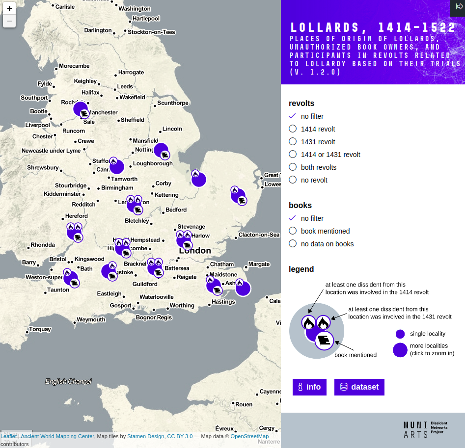

# Lollards, 1414–1522

## Places of origin of Lollards, unauthorized book owners, and participants in revolts related to Lollardy based on their

### https://dissinet.cz/lollards-map

### [dissinet project](http://dissinet.cz)

This interactive map is based on the Lollard trials. It shows the places of origin of English dissidents under investigation for taking part in the revolts of 1414 or 1431, related to Lollardy, or holding various heretical opinions that are commonly referred to as Lollard. In addition, it shows in which of these places the owners of unauthorised English religious books were uncovered. A total of 260 sites were transferred from the Atlas zur Kirchengeschichte by Jedin et al., based on the research of J. A. F. Thomson and J. Fines. The plotted sites indicate only the presence of suspected Lollards and revolt participants, not their numbers or importance.

- Data sources: Jedin et al., 1970; Thomson, 1970; Fines, 1964.
- Type of primary source: trial records.
- Digitized and geocoded by **Jan Král**.
- Map by [**Adam Mertel**](https://github.com/adammertel).
- Recommended citation: `Král, J., & Mertel, A. (2019). Lollards, 1414–1522: Places of origin of Lollards, unauthorized book owners, and participants in revolts related to Lollardy based on their trials. Dissident Networks Project (DISSINET). Retrieved June 3, 2019, from https://dissinet.cz/outputs/lollards-map.`

